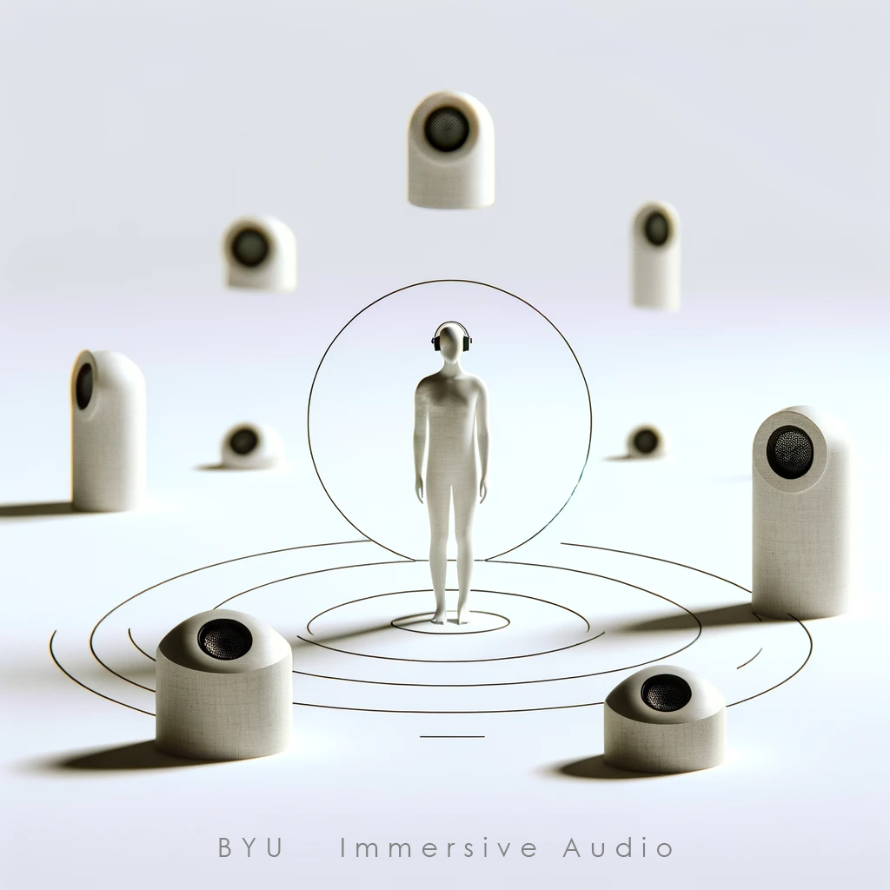

# Immersive Audio Composition

> A Growing Resource for Composers and Sound Designers

---

## About This Site

Welcome to the forefront of exploration in **Immersive Audio Composition**! This site serves as a dynamic resource for composers, sound designers, and anyone intrigued by the expanding world of immersive audio. Compiled through projects and rigorous research led by Kevin Anthony, Assistant Professor of Composition at Brigham Young University (BYU), this platform showcases the innovative work of BYU students.

---

## Our Philosophy

*Precedent informs the Idea. The Idea informs the Experiment. The Experiment necessitates the Tools. The tools necessitate more experimentation. And it never ends...please help me, it never ends.*

---

## Explore Our Content

- **Methods and Ideas**: Discover new methods and ideas for creating immersive audio compositions.
- **Technical Concepts**: Dive into the technical aspects, including Spatial Audio, Surround Sound, 3D Sound, and more.
- **Formats and Technologies**: Learn about various formats like Dolby Atmos, Ambisonics, and the latest in audio technologies.
- **Styles and Mediums**: Explore different styles and mediums, such as Acousmatic, Electroacoustic, and Interactive Electronic Music.

---

## Links

- [BYU Composition Area](https://music.byu.edu/composition)
- [BYU School of Music](https://music.byu.edu)

---

### Contact Us

For inquiries, collaborations, or feedback, feel free to [contact us](mailto:kevin_p_anthony+ems@byu.edu).

---

*This site is maintained by the BYU School of Music, under the guidance of Professor Kevin Anthony and the creative contributions of students.*

